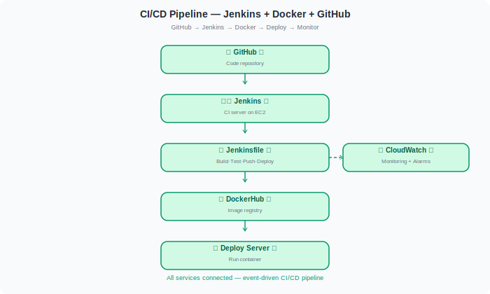

# 🏗️ CI/CD Pipeline with Jenkins + Docker + GitHub

> **DevOps Project 1 of 4** | Built by Pratik Gadekar | AWS Certified Cloud Practitioner

A complete CI/CD pipeline that automatically builds, tests, pushes a Docker image, and deploys an application every time code is pushed to GitHub.

[](https://jenkins.io)
[](https://docker.com)
[](https://github.com)

---

## 🚀 Project Overview

```
Developer pushes code to GitHub
           ↓
   GitHub Webhook fires
           ↓
   Jenkins picks up job
           ↓
  Jenkinsfile runs stages:
   Checkout → Build → Test → Push → Deploy
           ↓
  Docker image on DockerHub
           ↓
  Container live on server
           ↓
  CloudWatch monitors logs
```

---

## 🏗️ Full Architecture



---

## 🛠️ Tools Used

| Tool | Purpose |
|---|---|
| **Jenkins** | CI/CD server — runs pipeline stages |
| **GitHub** | Source code + webhook trigger |
| **Docker** | Containerize the application |
| **DockerHub** | Docker image registry |
| **EC2** | Hosts Jenkins and deployment server |
| **CloudWatch** | Monitors logs and sets alarms |

---

## ⚙️ Step-by-Step Setup

---

### Step 1️⃣ — Install Jenkins on EC2

> Launch an EC2 instance and install Jenkins + Docker on it.


**EC2 Setup:**
```
AMI:            Ubuntu 22.04 LTS
Instance Type:  t3.small (2 vCPU, 2 GiB RAM)
Security Group: port 22 (SSH), port 8080 (Jenkins)
```

**Auto-install with script:**
```bash
bash scripts/install-jenkins.sh
```

**Or manually:**
```bash
sudo apt-get update -y
sudo apt-get install -y openjdk-11-jdk

# Add Jenkins repo
curl -fsSL https://pkg.jenkins.io/debian-stable/jenkins.io-2023.key \
  | sudo tee /usr/share/keyrings/jenkins-keyring.asc > /dev/null
echo "deb [signed-by=/usr/share/keyrings/jenkins-keyring.asc] \
  https://pkg.jenkins.io/debian-stable binary/" \
  | sudo tee /etc/apt/sources.list.d/jenkins.list > /dev/null

sudo apt-get update -y && sudo apt-get install -y jenkins
sudo systemctl enable jenkins && sudo systemctl start jenkins

# Install Docker
sudo apt-get install -y docker.io
sudo usermod -aG docker jenkins
```

**Access Jenkins:** `http://YOUR-EC2-IP:8080`

Get initial password:
```bash
sudo cat /var/lib/jenkins/secrets/initialAdminPassword
```

---

### Step 2️⃣ — Connect GitHub Webhook

> Configure GitHub to notify Jenkins automatically on every push.


**In GitHub → Your repo → Settings → Webhooks:**
```
Payload URL:   http://YOUR-JENKINS-IP:8080/github-webhook/
Content type:  application/json
Events:        Just the push event ✅
Active:        ✅
```

**In Jenkins:**
1. New Item → **Pipeline** → name it `my-app-pipeline`
2. Build Triggers → ✅ **GitHub hook trigger for GITScm polling**
3. Pipeline → **Pipeline script from SCM**
4. SCM: Git → enter your GitHub repo URL
5. Branch: `*/main`
6. Script Path: `Jenkinsfile`

---

### Step 3️⃣ — Write the Jenkinsfile

> The Jenkinsfile defines all pipeline stages. It lives in the root of your repo.


**Pipeline stages:**

```groovy
pipeline {
    agent any
    environment {
        DOCKER_IMAGE = "yourusername/my-app"
        DOCKER_TAG   = "${env.BUILD_NUMBER}"
    }
    stages {
        stage('Checkout') { steps { checkout scm } }

        stage('Build') {
            steps {
                sh "docker build -t ${DOCKER_IMAGE}:${DOCKER_TAG} ."
            }
        }

        stage('Test') {
            steps {
                sh "docker run --rm ${DOCKER_IMAGE}:${DOCKER_TAG} npm test"
            }
        }

        stage('Push') {
            steps {
                sh "docker push ${DOCKER_IMAGE}:${DOCKER_TAG}"
                sh "docker push ${DOCKER_IMAGE}:latest"
            }
        }

        stage('Deploy') {
            steps {
                sh "docker stop my-app || true"
                sh "docker run -d --name my-app -p 80:5000 ${DOCKER_IMAGE}:latest"
            }
        }
    }
}
```

> Full Jenkinsfile in [`Jenkinsfile`](Jenkinsfile)

---

### Step 4️⃣ — Docker Build & Push to DockerHub

> Jenkins builds the Docker image and pushes it to DockerHub.


**Add DockerHub credentials in Jenkins:**
1. Dashboard → Manage Jenkins → Credentials
2. Add credentials → Username + Password
3. ID: `dockerhub-credentials`

**Dockerfile** (`app/Dockerfile`):
```dockerfile
FROM node:18-alpine
WORKDIR /app
COPY package*.json ./
RUN npm install --production
COPY . .
EXPOSE 3000
CMD ["node", "server.js"]
```

**Manual test:**
```bash
docker build -t yourusername/my-app:1.0 .
docker login
docker push yourusername/my-app:1.0
```

---

### Step 5️⃣ — Deploy Container to Server

> Jenkins SSH's into the deploy server and runs the latest Docker image.


**Deploy stage commands:**
```bash
# Pull latest image
docker pull yourusername/my-app:latest

# Stop old container
docker stop my-app || true
docker rm   my-app || true

# Run new container
docker run -d \
  --name my-app \
  --restart unless-stopped \
  -p 80:3000 \
  yourusername/my-app:latest

# Verify
docker ps
curl http://localhost
```

**Add SSH credentials in Jenkins:**
1. Manage Jenkins → Credentials → Add
2. Kind: SSH Username with private key
3. ID: `deploy-server-ssh`

---

### Step 6️⃣ — Monitor with CloudWatch

> CloudWatch captures Jenkins logs and application metrics, and sends alerts on failure.


**Install CloudWatch Agent on EC2:**
```bash
sudo apt-get install -y amazon-cloudwatch-agent

# Configure agent
sudo /opt/aws/amazon-cloudwatch-agent/bin/amazon-cloudwatch-agent-config-wizard

# Start agent
sudo systemctl start amazon-cloudwatch-agent
```

**Create CloudWatch Alarm for failed builds:**
```bash
aws cloudwatch put-metric-alarm \
  --alarm-name "Jenkins-Build-Failure" \
  --metric-name StatusCheckFailed \
  --namespace AWS/EC2 \
  --statistic Maximum \
  --period 60 \
  --threshold 1 \
  --comparison-operator GreaterThanOrEqualToThreshold \
  --evaluation-periods 1 \
  --alarm-actions arn:aws:sns:us-east-1:ACCOUNT_ID:jenkins-alerts
```

---

## 📁 Repository Structure

```
01-ci-cd-jenkins-docker/
├── README.md
├── Jenkinsfile                     ← Pipeline definition
├── app/
│   └── Dockerfile                  ← App container image
├── architecture/
│   ├── overview.svg
│   ├── step-01.svg  →  step-06.svg ← Step-by-step diagrams
├── scripts/
│   └── install-jenkins.sh          ← Auto-installs Jenkins + Docker
├── docs/
└── screenshots/
```

---

## 🔥 Future Improvements

| Feature | Tool |
|---|---|
| Parallel test stages | Jenkins parallel{} blocks |
| Code quality gate | SonarQube |
| Notifications | Slack Jenkins plugin |
| Kubernetes deploy | kubectl in Jenkinsfile |
| GitOps | ArgoCD |

---

## ✅ Skills Demonstrated

- 🏗️ Jenkins installation and configuration on EC2
- 🐙 GitHub webhook integration
- 📋 Declarative Jenkinsfile pipeline (6 stages)
- 🐳 Docker build, tag, push to DockerHub
- 🚀 Automated container deployment
- 📊 CloudWatch monitoring and alerting

---

## 👨‍💻 Author

**Pratik Gadekar** | Cloud & DevOps Enthusiast 🚀
AWS Certified Cloud Practitioner (CLF-C02)
